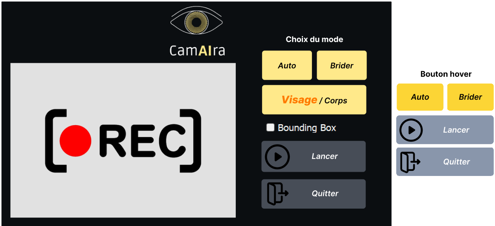

# Projet-IA-following-camera

## Description

This project tracks and follows a person as they move through a scene. The camera captures a video stream, which is sent to one or more artificial intelligence models. Their role is to detect bodies or heads. The coordinates of the detected bounding boxes are then used by a motor to rotate the camera more or less, so that the subject is always centered in the camera's field of view. This can be imagined, for example, for video surveillance, video lessons or conferences.

*Interface overview*

### Table of Contents: 
- Hardware
- Installation
- Usage
- Improvements
- Team members

### Hardware
This project uses the following hardware:

- [OAK-1 Camera](https://shop.luxonis.com/products/oak-1)
- [Pan-Tilt HAT – Full kit](https://shop.pimoroni.com/products/pan-tilt-hat?variant=22408353287)
- [Raspberry Pi 4](https://www.raspberrypi.com/products/raspberry-pi-4-model-b/)

### Installation

Run 'pip install -r code/setup/requirements.txt'. Some libraries may be missing from this file.

### Usage

This project is composed of two modes. The first, which is activated by default, consists of detecting and tracking people (whole bodies). The second one consists in detecting faces, and recognizing them.

To launch a mode, select it, then click on the 'lancer' button. To stop it, click on the 'arrêter' button.

For head detection mode, you'll need to save your head in the project database. This can be found in the 'databases' folder. When this mode is launched, all files in this folder are deleted. By clicking on the "lancer" button, you will be prompted to save your head in the database, in '.npz' format. To validate this face, click the 'arrêter' button. Once your head has been saved, you can click on the "launch" button, and the person with the best recognition percentage compared with the head saved in the database will then be tracked. 

Whichever mode you use, you'll be able to:
- Choose whether or not to display bounding boxes by activating a checkbox.
- Set field-of-view limits, so that the camera doesn't turn into unwanted areas.
- Stop or activate tracking.

### Improvements

- **Add Tracking to body detection mode**: We currently track the person with the highest detection percentage as an individual. However, this is not very sensible. If two or more people are present in the camera's field of view, it won't know who to look at. Tracking, for example, would enable the camera to focus only on the first person to enter the field of view.

- **Improving visual appearance.**

- **Improve the quality of the facial recognition system.**

#### Team members
- [Martin ASCOUET](https://github.com/Martin-Ascouet)
- [Julian BURTIN](https://github.com/Julian-bt)
- [Mathieu BUSQUET](https://github.com/MathieuBsqt)
- [Matthieu DIARD](https://github.com/Matthieu291)
- [Juliette LACOUR](https://github.com/JulLac)
- [Mael MOCK]()
